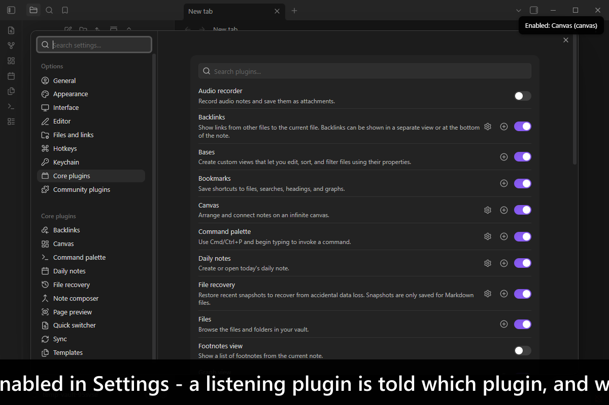
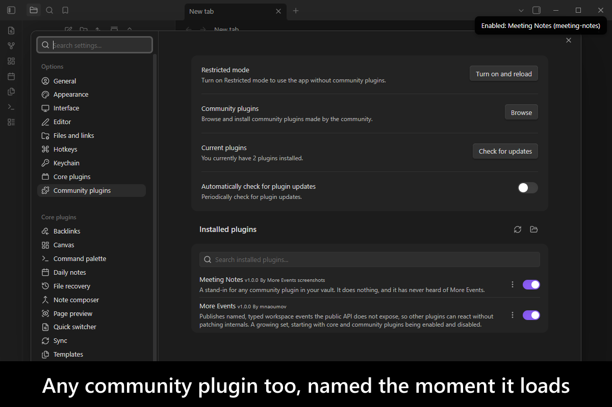
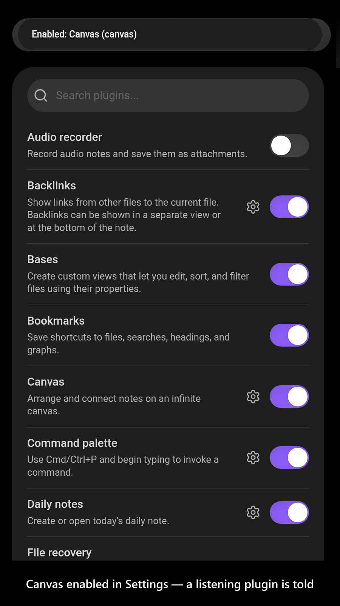
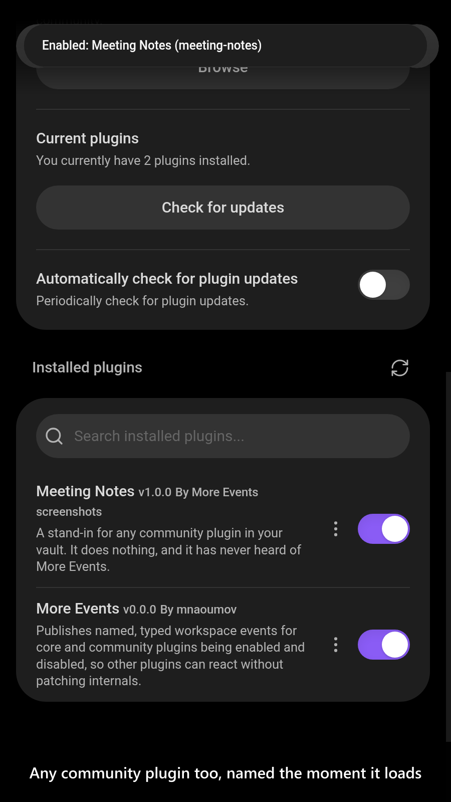

# More Events

[](https://www.buymeacoffee.com/mnaoumov) [](https://github.com/mnaoumov/obsidian-more-events/releases) [](https://github.com/mnaoumov/obsidian-more-events/releases) [](https://github.com/mnaoumov/obsidian-more-events)

A plugin that reacts to another plugin — one of [Obsidian](https://obsidian.md/)'s core plugins like Backlinks, Canvas or Graph, or a community plugin it integrates with — has to know when that plugin goes away and when it comes back. Obsidian does emit something: `app.internalPlugins` fires an untyped `change` when a core plugin's state moves, and `app.plugins` fires an untyped `changed` when a community plugin's does. Neither says **which** plugin moved, or in which direction — the community one carries no payload whatsoever — and both hang off internal objects with no published types. So the usual answer is to monkey-patch `InternalPlugin.prototype.enable` — and when two plugins in the same vault do that, there are two patches on one prototype.

This plugin does that patching once, for everybody. It watches the signals Obsidian already sends, works out what actually changed, recovers the one thing those signals drop — whether Obsidian was told the user did it — and re-publishes the lot on `app.workspace` as four named, typed, per-plugin events any plugin can listen for with no dependency beyond `obsidian` itself. One patch on the shared prototype instead of one per interested plugin is the whole point: **you** do not patch.

**It has no user interface.** Nothing to configure, nothing to click: install it, and the events are there for the plugins that need them. So the screenshots below are of *another* plugin reacting — a listener raising a notice as a plugin is toggled in Settings, which is the only thing here there is to see.

<!-- markdownlint-disable MD033 -->

<a href="https://github.com/mnaoumov/obsidian-more-events/blob/HEAD/images/screenshots/screenshot-desktop-1.png"></a>

<details>
<summary>More screenshots</summary>

<div>
<a href="https://github.com/mnaoumov/obsidian-more-events/blob/HEAD/images/screenshots/screenshot-desktop-2.png"></a>
<a href="https://github.com/mnaoumov/obsidian-more-events/blob/HEAD/images/screenshots/screenshot-mobile-1.png"></a>
<a href="https://github.com/mnaoumov/obsidian-more-events/blob/HEAD/images/screenshots/screenshot-mobile-2.png"></a>
</div>

</details>

<!-- markdownlint-enable MD033 -->

## Demo vault

**The documentation is a demo vault.** Its notes explain what the events are and when they fire, with buttons that subscribe to them live so you can toggle a plugin in Settings and watch them arrive.

**[Start reading here](<./demo-vault/00 Start.md>)** — it is plain markdown, so it works on GitHub with nothing installed.

A copy of the vault ships with every release. You can access it via any of the following:

1. Running the **More Events: Open demo vault** command.
2. Downloading `more-events-demo-vault.zip` from the [Releases](https://github.com/mnaoumov/obsidian-more-events/releases). It unzips into a single `more-events-demo-vault-<version>` folder.
3. Browsing its source in [`demo-vault/`](./demo-vault/README.md) in this repository.

## What it does

- **`more-events:core-plugin-enabled`** fires on `app.workspace` after a core plugin has been enabled, carrying that plugin's id and display name. [01 Core plugin events](<./demo-vault/01 Core plugin events.md>)
- **`more-events:core-plugin-disabled`** fires the same way after one has been disabled. [01 Core plugin events](<./demo-vault/01 Core plugin events.md>)
- **`more-events:community-plugin-enabled`** and **`more-events:community-plugin-disabled`** are the same pair for community plugins. [02 Community plugin events](<./demo-vault/02 Community plugin events.md>)
- **A small API** answers the question the events cannot: which plugins are enabled *right now*, which is what a listener needs when it first loads. [03 For plugin developers](<./demo-vault/03 For plugin developers.md>)
- **Every payload says whether the user did it**, as `isUserInitiated`. Obsidian takes that answer as an argument, uses it to decide whether the plugin's own `onUserEnable` hook runs, and then drops it before it raises the signal these events are built on. More Events keeps it.

Every event is **per plugin** — one event per plugin that actually changed, so a listener never has to diff anything — and **past tense**: by the time yours runs, the plugin has already been enabled or disabled.

For community plugins, **enabled means loaded**: the plugin's code is running. That is deliberately not the same as it being ticked in **Settings -> Community plugins**, which Obsidian tracks separately and which stays untouched when the master **Community plugins** switch unloads every one of them.

`isUserInitiated` is **Obsidian's own notion of the user doing it, not a broader one**: it means that plugin's own toggle was flipped. Turning the master **Community plugins** switch off is a person's doing and reports `false`, because Obsidian passes no flag down that path — and so does starting a vault in restricted mode. It is also a claim rather than a proof: a plugin that calls `enable(true)` itself reports `true`, because that is what Obsidian itself believes.

## Why it patches, when the point was to stop you patching

It patches exactly one thing, and that is not a contradiction of the paragraph above — it is what makes it true. The hazard is never *a* patch; it is **N** plugins patching one shared prototype, at different versions, each unaware of the others. A plugin is where such a patch belongs, precisely because a vault holds one copy of it. So the prototype carries one patch, installed once, removed cleanly when the plugin unloads, and every consumer gets the context without adding a second.

The patch supplements the diff rather than replacing it. What it intercepts is the transition; what makes the events per-plugin — and correct when Obsidian collapses several transitions into one debounced signal — is still the diff.

## What it deliberately does not do

- **It does not fire for the plugins that were already enabled when it loaded.** Nothing changed, so nothing is announced; read the starting state from the API instead.
- **It does not replace `obsidian-dev-utils`' broadcast, and it overlaps with it.** That library broadcasts `obsidian-dev-utils:plugin-loaded` / `-unloaded`, but only for plugins built on it. The community-plugin events here cover **every** plugin in the vault, including the ones that have never heard of that library — which is the gap they exist to fill. A plugin built on it raises both, so subscribe to one and not to both.

## For plugin developers

The events and the API are this plugin's whole point, and both are declared in [`api.d.ts`](./api.d.ts) — hand-written, and importing nothing but `obsidian`, so you can depend on it without depending on anything of mine.

The events need no API handle at all. Copy the declarations from `api.d.ts` into your own project, or hardcode the names, and subscribe:

```ts
this.registerEvent(
  this.app.workspace.on('more-events:core-plugin-enabled', ({ corePluginId, corePluginName, isUserInitiated }) => {
    if (isUserInitiated) {
      console.log(`${corePluginName} (${corePluginId}) is back, because someone turned it back on`);
    }
  })
);

this.registerEvent(
  this.app.workspace.on('more-events:community-plugin-disabled', ({ communityPluginId, communityPluginName }) => {
    console.log(`${communityPluginName} (${communityPluginId}) has gone`);
  })
);
```

For the current state, and to know whether More Events is installed at all, take the API through the registry. The contract is **`1.2.0`** and moves independently of the plugin's own version, so ask for a range:

```ts
import { watchPluginApi } from 'obsidian-dev-utils/obsidian/plugin/plugin-api';

const moreEventsApiRef = watchPluginApi<MoreEventsApi>({
  apiVersionRange: '^1',
  app: this.app,
  component: this,
  pluginId: 'more-events'
});

// `value` is always current and never stale: it is `null` while More Events is not loaded, and becomes
// non-`null` on its own when it is.
const moreEventsApi = moreEventsApiRef.value;
if (moreEventsApi) {
  console.log(moreEventsApi.getEnabledCorePluginIds());
  console.log(moreEventsApi.isCorePluginEnabled('backlink'));
  console.log(moreEventsApi.getEnabledCommunityPluginIds());
  console.log(moreEventsApi.isCommunityPluginEnabled('dataview'));
}
```

If you would rather not depend on `obsidian-dev-utils` for that, the registry is a documented wire protocol you can read directly — see [Cross-plugin APIs](https://mnaoumov.dev/obsidian-dev-utils/guides/cross-plugin-apis/).

## Installation

The plugin is not yet listed in [the official Community Plugins repository](https://community.obsidian.md/plugins). Until it is, install it as a beta release.

### Beta versions

To install the latest beta release of this plugin (regardless if it is available in [the official Community Plugins repository](https://community.obsidian.md) or not), follow these steps:

1. Ensure you have the [BRAT plugin](https://community.obsidian.md/plugins/obsidian42-brat) installed and enabled.
2. Click [Install via BRAT](https://intradeus.github.io/http-protocol-redirector?r=obsidian://brat?plugin=https://github.com/mnaoumov/obsidian-more-events).
3. An Obsidian pop-up window should appear. In the window, click the `Add plugin` button once and wait a few seconds for the plugin to install.

## Debugging

By default, debug messages for this plugin are hidden.

To show them, run the following command in the `DevTools Console`:

```js
window.DEBUG.enable('more-events');
```

For more details, refer to the [documentation](https://mnaoumov.dev/obsidian-dev-utils/guides/debugging/).

## Changelog

All notable changes to this project will be documented in the [CHANGELOG](./CHANGELOG.md).

## Contributing

Contributions are welcome — see [CONTRIBUTING](./CONTRIBUTING.md) to get set up.

## Support

<!-- markdownlint-disable MD033 -->

<a href="https://www.buymeacoffee.com/mnaoumov" target="_blank"></a>

<!-- markdownlint-enable MD033 -->

## My other Obsidian resources

[See my other Obsidian resources](https://github.com/mnaoumov/obsidian-resources).

## License

© [Michael Naumov](https://github.com/mnaoumov/)
